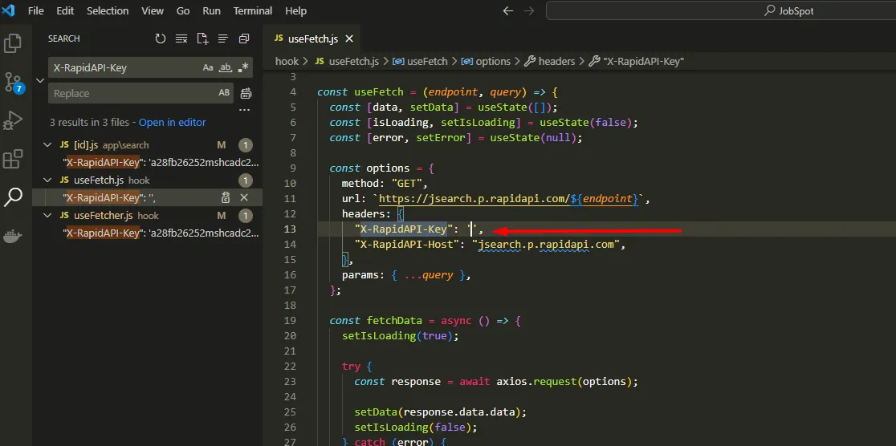
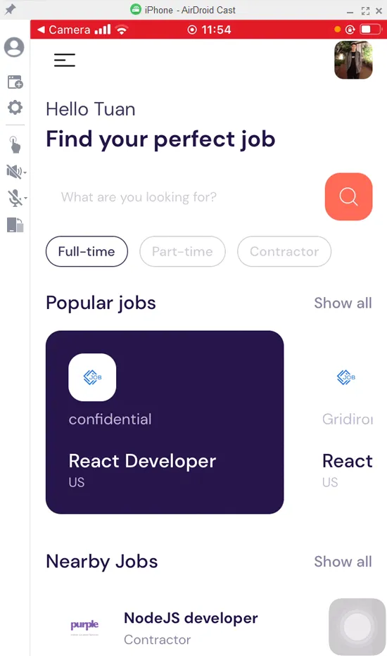

# Reactnative-jobs-search-app

Build jobs-search-app written by react native

## Prerequisite

- [Install NodeJs version v16.16.0](https://nodejs.org/en/blog/release/v16.16.0)
- [Setup Reactnative enviroment](https://github.com/ChamomileTommy/setup-reactnative-enviroment)
- [Subcribe API and copy X-RapidAPI-Key](https://rapidapi.com/letscrape-6bRBa3QguO5/api/jsearch)

## Build

Clone the project

```
git clone https://github.com/ChamomileTommy/reactnative-jobs-search-app.git
```

Go to the project directory

```
cd reactnative-jobs-search-app
```

Install dependencies

```
npm install
```

Paste above X-RapidAPI-Key into the places that contain X-RapidAPI-Key in the project



Run project and scan QR code

```
npm install -g expo-cli
expo-cli start --tunnel
```

Dont forget

```
Desktop, Mobile in Same Wifi
```

## Demo



## 🚀 About Me

I'm a full stack developer for 4 years
